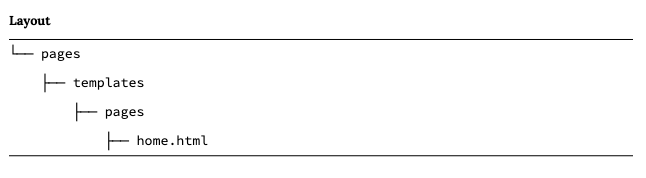
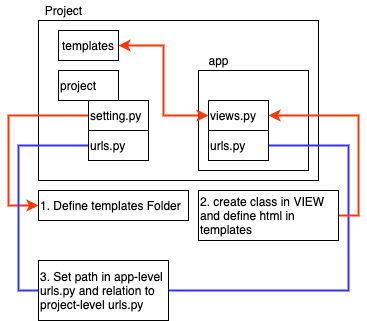

# Ch03 Pages app

## 1. Templates

Template, Views and URLs are basic elements of Django.

URLs: control the route, the entry point into page.

View: contain the logic or "what".

Template: with HTML.

---

Module : rely on database which is the view to do the work to decide what data is available to the template.

---

### There are 2 ways to place templates

1. in each pages, "apps-level" templates

    

2. Create "project-level" templates

    in ~/templates/home.html

    and update **settings.py** with 'DIRS'

    ```python
    # pages_project/setting.py
    TEMPLATES = [
        {
            ...
            'DIRS': [os.path.join(BASE_DIR, 'templates')], # new
            ...
        }
    ```

## 2. Class-Base Views

define class in apps/views , for this example

```python
# pages/views.py
from django.views.generic import TemplateView

class HomePageView(TemplateView):
    template_name = 'home.html'
```

## 3. URLs

update URLConfs.(URLs at project-level) to point out app-level URLs

```python
# pages_project/urls.py
from django.contrib import admin
from django.urls import path, include

urlpatterns = [
    path('admin/', admin.site.urls),
    path('', include('pages.urls'))
]
```

```python
# pages_project/pages/urls.py
from django.urls import path

from .views import HomePageView

urlpatterns = [
    path('', HomePageView.as_view(), name='home')
]
```

## 4. Add "About" Page

1. Add class-view in pages/views.py

    ```python
    # pages/views.py
    from django.shortcuts import render
    from django.views.generic import TemplateView
    
    class HomePageView(TemplateView):
        template_name = 'home.html'
    
    class AboutPageView(TemplateView):  # new
        template_name = 'about.html'
    ```

2. add url in pages/urls.py

    ```bash
    # pages/urls.py
    from django.urls import path
    
    from .views import AboutPageView, HomePageView
    
    urlpatterns = [
        path('', HomePageView.as_view(), name='home'),
        path('about/', AboutPageView.as_view(), name = 'about')  # new
    ]
    ```

## 5. Extending Templates

some content is repeated on every page( header, footer, etc), which we can create base.html as base.

we create base.html and let base.html, home.html extend from base.html.

```python
<!-- templates/base.html-->

<header>
    <a href="">Home</a> |
    <a href="">About</a>
</header>



```

```python
<!--template/about.html-->



<h1>About page</h1>

```

 is communicate 2 html.

## 6. Test

How to code test for app.  

```python
# pages/test.py
from django.test.testcases import SimpleTestCase

class SimpleTest(SimpleTestCase):
    def test_home_page_status_code(self):
        response = self.client.get('/')
        self.assertEqual(response.status_code, 200)
    
    def test_about_page_status_code(self):
        response = self.client.get('/about/')
        self.assertEqual(response.status_code, 200)
```

This is simple page test by use (SimpleTestCase). If using database, we will use (TestCase).

run follow command to test

```bash
python manage.py test
```

## Recall

1. Build page, from "settings" to "views" and last "urls" modify.
2. Add new page. By add "vews" and "urls"
3. Make TestCase in app-level and run test
4. working flow

    
