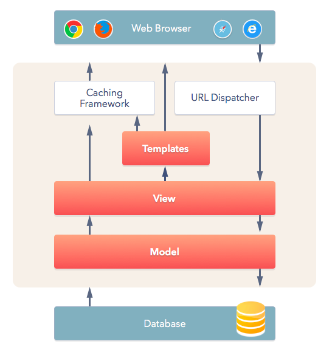

# Ch04 Models and Django admin

## Message Board app

## 1. init Set Up

- create mb_project

    ```bash
    > django-admin startproject mb_project
    ```

- create app posts

    ```bash
    > django manage.py startapp posts
    ```

- update setting.py

    ```python
    # mb_project/setting.py
    INSTALLED_APPS = [
        'posts.apps.PostsConfig', # new
        'django.contrib.admin',
        ...
    ]
    ```

- Run migrate to initial database on Django default settings.

## 2. Create a database model

Django imports a module to build new database modes. In this case create a textual content message with TextField.

In the following code, we creates  

a model called **Post**

*a type of content* with **TextField()**

```python
# post/models.py
from django.db import models

class Post(models.Model):
    text = models.TextField()
```

## 3. Activating models

whenever we create or modify an existing model we’ll need to update Django in a two-step process

1. create a migration file with *makemigrations* which generate the sql command for preinstalled app.
2. build the actual database with *migrate*.

```bash
> python manage.py makemigration posts
> python manage.py migrate posts
```

## 4. Django Admin

create with command line (admin/admin) in this case

```bash
> python manage.py createsuperuser
```

than locate it a localhost:8000/admin

than add app to admin page

```python
# posts/admin.py
from django.contrib import admin

from .models import Post

admin.site.register(Post)
```

Modify the Post Object to text which make it more representation

```python
# posts/models.py
from django.db import models

class Post(models.Model):
    text = models.TextField()

    def __str__(self):
        return self.text[:50]
```

## 5. Views/Templates/URLs

Last chapter, we use build-in generic Template-Views to display a template file in homepage. Now we use generic class-based ListView to list the contents of database model.

```python
# posts/views.py
from django.views.generic import ListView
from .models import Post

class HomePageView(ListView):
    model = Post
    template_name = 'home.html'
    context_object_name = 'all_posts_list'
```

Create and setting template folder path

```python
# setting.py
TEMPLATES = [
    {
        ...
        'DIRS': [os.path.join(BASE_DIR, 'templates')],
        ...
     },
]
```

use **Django Templating Languages** for **loop** to list all object in **context_object_name** list

```html
<!--templates/home.html-->

<h1>Message board homepage</h1>
<ul>
    
        <li>{{post}}</li>
    
</ul>
```

and last link project-level urls.py with app-level urls.py

```python
# mb_project/urls.py
urlpatterns = [
    path('admin/', admin.site.urls),
    path('', include('posts.urls')),
]
```

```python
# posts/urls.py
from django.urls import path

from .views import HomePageView

urlpatterns = [
    path('', HomePageView.as_view(), name='home'),
]
```

## 6. Writing Test

```python
# posts/tests.py
from django.test import TestCase
from .models import Post

class PostModelTest(TestCase):
    
    def setUp(self):
        Post.objects.create(text='just a test')

    def test_text_content(self):
        post=Post.objects.get(id=1)
        expected_object_name = f'{post.text}'
        self.assertEqual(expected_object_name, 'just a test')

class HomePageViewTest(TestCase):

    def setUP(self):
        Post.objects.create(text='this is HomeView test')
    
    def test_view_url_exitsts_at_proper_location(self):
        resp = self.client.get('/')
        self.assertEqual(resp.status_code, 200)

    def test_view_url_by_name(self):
        resp = self.client.get(reversed('/home/'))
        self.assertEqual(resp.status_code,200)

    def test_view_uses_correct_tempate(self):
        resp = self.client.get(reversed('/home/'))
        self.assertEqual(resp.status_code, 200)
        self.assertTemplateUsed(resp, 'home.html')
```

## Recall

1. Understand model create and activate.
2. Connect  View with both Models and Templates
3. How to use Django Admin
4. Use TestCase as Test, to test database and homepage
5. Review MVT structure as below

    
