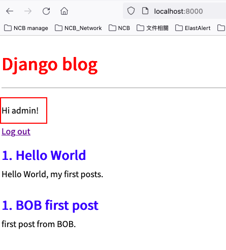

# Ch 07 User Account

## User Account

We will use build-in user authentication system to create login, logout, and Sign On pages.

By Django **auth** app, which provides with a User object include  

- username
- password
- email
- first_name
- last_name

## 1. Log in

### Set Path on project-level url (URLs)

```python
# blog_project/urls.py
urlpatterns = [
...
    path('accounts/', include('django.contrib.auth.urls')),
...
]
```

### Create html (T)

By default, Django will look within a template folder called **registration** and the file within it.

```html
<!-- templates/registration/login.html -->



<h2>Log In</h2>
<form method="post">
    
    {{ form.as_p }}
    <button type="submit">Log In</button>
</form>

```

Use &lt;form&gt;</form>&lt;/form&gt; and POST method send data to server. csrf_token to prevent XSS Attacks, and form.as_p to show as paragraph.  and add submit button.

Add Login redirect in setting.py to redirect to home after login success.

```python
# blog_project/setting.py
LOGIN_REDIRECT_URL = 'home'
```

## 2. Updated homepage

**is_authenticated** attribute : To show user is logged in or not.

```html
<!-- template/base.html -->
...

    <p>Hi {{ user.username}}!</p>
    <p><a href="">Log out</a></p>

    <p>You are not logged in.</p>>
    <a href="">Log In</a>



...
```

And test homepage, you can see our user in homepage

## 3. Log out link

In base.html just add  and in setting.py add **LOGOUT_REDIRECT_URL**

```python
# blog_project/setting.py
LOGIN_REDIRECT_URL = 'home'
LOGOUT_REDIRECT_URL = 'home' # new
```

Both login and logout will show as follow



## 4. Sign up

Use class **UserCreationForm** to create sign up page.

Just Create new app as old times

```bash
> python manage.py startapp accounts
```

```python
# blog_project/setting.py
INSTALL_APPS = [
  'blog.apps.BlogConfig',
  'accounts.apps.AccountsConfig',
  ...
]
```

### Update project-level urls (URLs)

```python
# blog_project/urls.py
...
urlpatterns = [
    path('admin/', admin.site.urls),
    path('accounts/', include('django.contrib.auth.urls')), # Djangle auth class
    path('accounts/', include('accounts.urls')),  # new
    path('',include('blog.urls')),
]
...
```

The Order of urls matters, because when we request **/account/signup** url Django first look in **auth**, and not find it and then proceed to account creation

### Create app-level urls (URLs)

```python
# accounts/urls.py
from django.urls import path
from .views import SignUpView

urlpatterns = [
    path('signup/', SignUpView.as_view(), name='signup')
]
```

### Create Views (V)

```python
# accounts/views.py
from django.contrib.auth.forms import UserCreationForm
from django.urls import reverse_lazy
from django.views import generic

class SignUpView(generic.CreateView):
    form_class = UserCreationForm
    success_url = reverse_lazy('login')
    template_name = 'signup.html'
```

- CreateView: Defin SignUpView with CreateView.
- UserCreationForm : build-in User create class.
- success_url: to redirect back to login page.
- url = link to template.

### Create Template (T)

```html
<!-- templates/signup.html -->



<h2>Sign Up</h2>
<form method="post">
    
    {{ form.as_p }}
    <button type="submit">Sign up</button>
</form>

```

and result  


We Customize this page by built-in [message framework](https://docs.djangoproject.com/en/4.0/ref/contrib/messages/).

## Recall

- Use Build-in Login Logout
- Understand Django build-in sign up and user authentication flow
- Reminder: How Django run on production environment  with gunicorn
