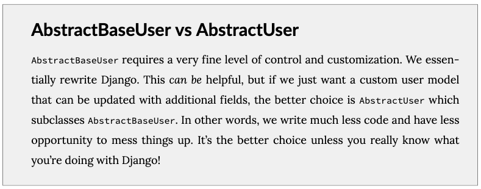

# Ch 08 Customer User Model

Django’s build-in User model allow us to start with user right away. However official Django documentation highly recommends use Custom User Model for new projects.

**Always use a custom user mode**l for all new Django’s projects. But official document example is use complex way. It use *AbstractBaseUser*; We use *AbstractUser* which is simpler and customizable

## 1. Set Up

- Create project “newspaper_project”
- Create app “users”

```bash
> django-admin startproject newspaper_project
> python manage.py startapp users
```

## 2. Custom User Model

- update settings.py

    AUTH_USER_MODEL config to tell Django use our Custom User

    ```python
    # newspaper_project/setting.py
    INSTALLED_APPS = [
        'users.app.UsersConfig',
        ...
    ]
    ...
    AUTH_USER_MODEL = 'users.CostomUser'
    ```

- create a new CustomUser model

    ```python
    from django.db import models
    from django.contrib.auth.models import AbstractUser
    
    class CustomUser(AbstractUser):
        age = models.PositiveIntegerField(null=True, blank=True)
    ```

    Here is the book difference between AbstarctBaseUser and AbstractUser explained by book.

    

  - null : **database-related**. it can store a database entry as NULL.
  - blank: **valication-related**. it means allown an emplty valuse.

    In practice, null and blank are commonly used together.

## 3. Forms

- create new forms for UserCreationForm and UserChangeForm

    we create UserCreationForm and UserChangeForm fuctions

    For new forms, we set *model* to our *CustomUser* and using default fields vis *Meta.fields* which include default fields. With ‘age’ add as extra fields.

    ```python
    # users/forms.py
    from django.contrib.auth.forms import UserCreationForm, UserChangeForm
    from django.forms import fields
    
    from .models import CustomUser
    
    class CustomUserCreationForm(UserCreationForm):
        
        class Meta(UserCreationForm.Meta):
            model = CustomUser
            fields = UserCreationForm.Meta.fields + ('age',)
    
    class CustomUserChangeForm(UserChangeForm):
        
        class Meta:
            model = CustomUser
            fields = UserChangeForm.Meta.fields
    ```

- update the admin

    Last update the admin. We will extend the existing UserAdmin class to use our new CustomUser model

    ```python
    # users/admin.py
    from django.contrib import admin
    from django.contrib.auth.admin import UserAdmin
    
    from .forms import CustomUserCreationForm, CustomUserChangeForm
    from .models import CustomUser
    
    class CustomUserAdmin(UserAdmin):
        add_form = CustomUserCreationForm
        form = CustomUserChangeForm
        model = CustomUser
    
    admin.site.register(CustomUser, CustomUserAdmin)
    ```

Last migrate the database.

## 4. Superuser

after superuser created. we can see admin page remain the same.


then we add list_display in admin.py

```python
# users/admin.py
...
class CustomUserAdmin(UserAdmin):
    add_form = CustomUserCreationForm
    form = CustomUserChangeForm
    model = CustomUser
    list_display = ['email', 'username', 'age', 'is_staff']
```

refresh the page  


### Recall

- How to create CustomUser with small example.
