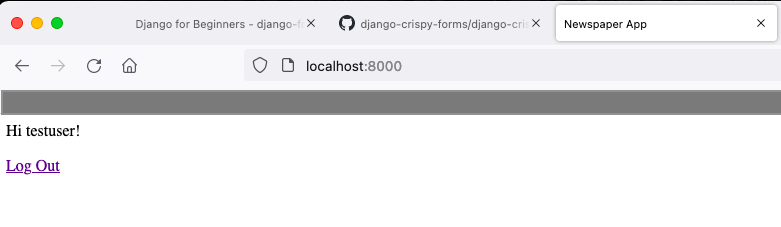

# Ch 09 User Authentication

## 1. Create Registration Template

- Create templates/registration
- Add Templates in setting.py
- Set LOGIN_REDIRECT_URL and LOGOUT_REDIRECT_URL
- Create templates
  - templates/registration/login.html
  - templates/base.html
  - templates/home.html
  - templates/signup.html

## 2. URLs

- Setting urls in project-level and project-level

    ```python
    # newspaper_project/urls.py
    from django.contrib import admin
    from django.urls import path, include
    from djagno.views.generic.base import TemplateView
    
    urlpatterns = [
        path('admin/', admin.site.urls),
        path('users/', include('users.urls')),
        path('users/', include('django.contrib.auth.urls')),
        path('', TemplateView.as_view(template_name='home.html'), name='home'),
    ]
    ```

    ```python
    # users/urls.py
    from django.urls import path
    
    from .views import SignUpView
    
    urlpatterns = [
        path('signup/', SignUpView.as_view(), name='signup')
    ]
    ```

- Create Class SignUpView() in users/views.py
- Check Log In, Sign Up, and redirect

## 3. Admin and Authentication

- Use “Sign Up” page create new user, and

    

- Switch to admin page, and User don’t have access to admin page

    

### 3.1 User Forms

As we login admin page, we can see the testuser did not have “Email Address”. As our “Sign Up” page did not have this parameter in page.

Let’s return to `users/forms.py`, under `fields` we were use `Meta.fields` to display the default setting. Custom field to show differences.

```python
# users/forms.py
...
class CustomUserCreationForm(UserCreationForm):
    
    class Meta(UserCreationForm.Meta):
        model = CustomUser
        fields = ('username', 'email', 'age',) # new

class CustomUserChangeForm(UserChangeForm):
    
    class Meta:
        model = CustomUser
        fields = ('username', 'email', 'age',) # new
...
```

## Recall

- Create Work flow of User Log In/Out and Sign Up
- Custom Sign Up page with fields
- Build-In User method of Djagno
