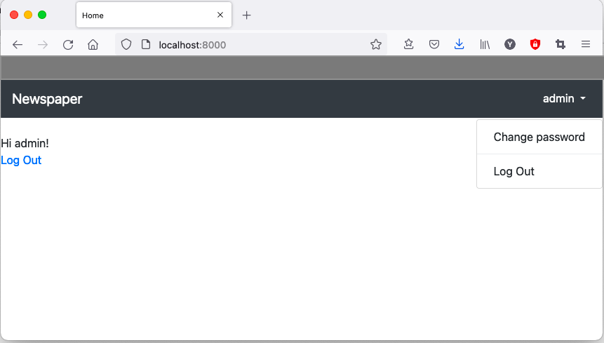

# Ch 10 Bootstrap

## Bootstrap

Bootstrap could be define as a template of HTML/CSS, or use bootstrap to do heavy lifting. This chapter let you focus on project and function not the design and art.

## 1. Pages app

Create pages app

- `startapp pages` to create app.
- set project-level urls and app-level urls
- code `pages/view` use **TemplateView**

## 2. Test

Write test for our project with four pages

1. home
2. sign up
3. log in
4. log out

Only need to write test of first two pages. Log in and Log out are part of Django and rely on internal views and URL routs.

```python
# pages/tests.py

class HomePageTests(SimpleTestCase):
    def test_home_page_status_code(self):
        # define status code
    def test_view_url_by_name(self):
        # test reverse url 
    def test_view_use_correct_template(self):
        # test template

class SignupPageTests(TestCase):
    username = 'newuser'
    email = 'newuser@email.com'

    def test_signup_page_status_code(self):
        ...
    def test_view_url_by_name(self):
        ...
    def test_view_uees_correct_template(self):
        ...
    def test_signup_form(self):
        new_user  = get_user_model().objects.create_user(
            self.username, self.email)
        self.assertEqual(get_user_model().objects.all().count(), 1 )
        self.assertEqual(get_user_model().objects.all()
                        [0].username, self.username)
        self.assertEqual(get_user_model().objects.all()
                        [0].email, self.email)
```

In Test, we test 3 things:

1. the page exists and return a HTTP status code 200
2. the page uses the correct url name in the view
3. the proper template

In `SignupPageTest.test_signup_form` we use `get_user_model()` to reference our custom user model.

## 3. Bootstrap

There are 2 ways to add Bootstrap to a project.

1. download all files and serve them locally
2. use Content Delivery Network (CDN)

In this case, I use CDN with following [link templates](https://getbootstrap.com/docs/4.1/getting-started/introduction/) ( include Bootstrap.css, jQuery.js, Popper.js, Bootstrap.js)

After that add our logic in `template/base.html` , and result like



## 4. Sign Up Form

This part defined how to modify default Django Sign Up page. To modify this page we have 3 option

- override the existing `help_text`
- hide the `help_text`
- restyle the `help_text` ← we choose this

We use 3rd party package to do so [django-crispy-forms](https://github.com/django-crispy-forms/django-crispy-forms). Use pip to install and add it to setting.py

```python
# newspaer_project/setting.py
INSTALLED_APPS = [
    # local
    'users.apps.UsersConfig',
    'pages.apps.PagesConfig',
    
    # 3rd Party
    'crispy_forms',

    'django.contrib.admin',
    ...
]

CRISPY_TEMPLATE_PACK = 'bootstrap4'
```

In signup.html template we can use crispy forms. By swap out `{{ form.as_p }}` for `{{ form|crispy }}`

## Conclude

- Create page app and design test work flow
- Hand on with Bootstrap
- 3rd restyle Sign On page
