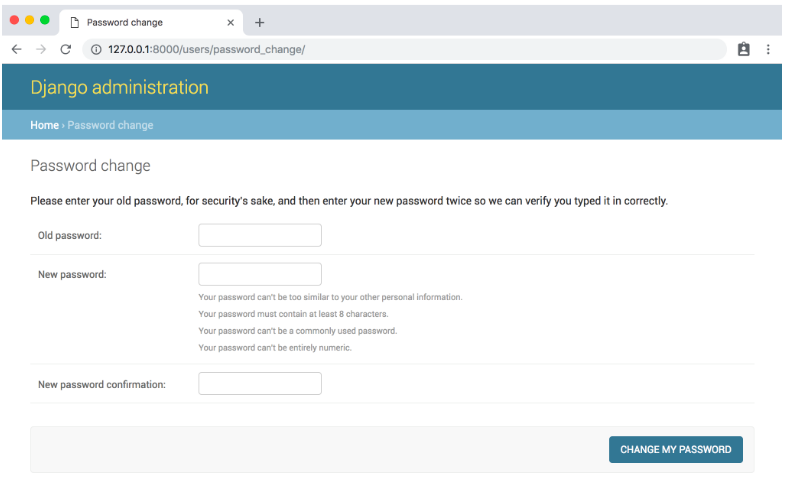

# Ch 11 Password Change and Rest

## Password Change and Reset

In this chapter we will create authorization flow of app by adding “password change” and “reset”.

## 1. Password Change

To use Django default implementation. Navigate to the “Password change page” at **localhost:8000/users/password_change/**



This is default “password change” page looks like. And after this is extra /done to urls to tell you password reseted.

## 2. Customizing password change

To customize “password change” and “password reset”, we have to create these pages in registration folder.

- create `password_change_form.html` and `password_change_done.html`

New “Password change”  


## 3. Password reset

Add email setting in setting.py In this section we use console backend to check email information.

```python
# newspaper_project/setting.py
EMAIL_BACKEND = 'django.core.mail.backends.console.EmailBackend'
```

use url [localhost:8000/users/password_reset](http://localhost:8000/users/password_reset) to send email, and get information at console

```bash
[25/Jan/2022 09:03:04] "GET /users/password_reset/ HTTP/1.1" 200 2767
Content-Type: text/plain; charset="utf-8"
MIME-Version: 1.0
Content-Transfer-Encoding: 8bit
Subject: Password reset on localhost:8000
From: webmaster@localhost
To: user2@testmail.com
Date: Tue, 25 Jan 2022 09:03:10 -0000
Message-ID: <164310139026.6176.12046099622072719848@1.0.0.127.in-addr.arpa>

You're receiving this email because you requested a password reset for your user account at localhost:8000.

Please go to the following page and choose a new password:

http://localhost:8000/users/reset/NA/azsuha-cf1eb7af628d9888170d90b4a673cfe9/

Your username, in case you’ve forgotten: user2

Thanks for using our site!

The localhost:8000 team
```

and use the link to reset password

## 4. Custom Templates

Create following html template

- templates/registration/password_reset_form.html
- templates/registration/password_reset_done.html
- templates/registration/password_reset_confirm.html
- templates/registration/password_reset_complete.html

## 5. Conclusion

- Finish “password change” and “reset” flow
- Custom each relate html pages
