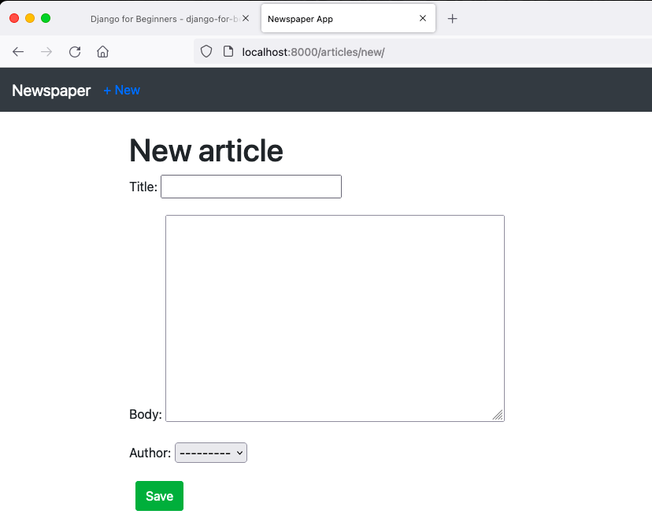

# Ch 13 Newspaper app

## Newspaper app

We’ll build articles page where user can post articles, edit or delete articles.

## 1. Article app

- startapp articles : to create app.
- Add app in INSTALLED_APPS in settings.
- Define articles/models.py
    1. For author, we use `get_user_model` to reference our custom user model ‘users.CustomUser’.
    2. `__str__` method for viewing the model in admin interface.
    3. use `get_absolute_url` implements the way to detail page.

    ```python
    # articles/models.py
    ...
    class Article(models.Model):
        title = models.CharField(max_length=255)
        body = models.TextField()
        date = models.DateTimeField(auto_now_add=True)
        author = models.ForeignKey(
            get_user_model(),
            on_delete=models.CASCADE,
        )
    
        def __str__(self):
            return self.title
    
        def get_absolute_url(self):
            return reverse('article_detail', args=[str(self.id)])
    ```

- “makemigrations” and “migrate” database models.
- Update admin.py so new app can displayed.
- Test with [localhost:8000](http://localhost:8000) to add some data.

## 2. Setting URLs and Views

- setting project-level URLs and app-level URLs
- Let page start with all article list

    ```python
    # articles/urls.py
    ...
    urlpatterns = [
        path('', ArticleListView.as_view(), name='article_list'),
    ]
    ```

- Create build-in generic ListViews form Django

    ```python
    # articles/views.py
    ...
    class ArticleListView(ListView):
        model = Article
        template_name = 'article_list.html'
    ```

- Implement templates.

    Bootstrap has a build-in component called **Cards** which customize for individual articles. Which show title, author and date in card header and article body in card body. And link to edit and delete pages.

    ```html
    <!-- template/article_list.html -->
    
    
    Articles
    
    
        
        <div class="card">
            <div class="card-header">
                <span class="font-weight-bold">{{ article.title }}</span> &middot;
                <span class="text-muted">by {{ article.author }} | {{ article.date }}</span>
            </div>
            <div class="card-body">
                {{ article.body}}
            </div>
            <div class="card-footer text-center text-muted">
                <a href="">Edit</a> | 
                <a href="">Delete</a>
            </div>
        </div>
        <br />
        
    
    ```

## 3. Create Edit/Delete methods

Create edit and delete options with new urls, views, and templates.

Take advantage of Django automatically adds a primary key to each database. So that, the first article with primary key 1 will be at articles/1/edit and delete route will be article/1/delete/.

```python
# article/urls.py
...
urlpatterns = [
    path('<int:pk>/edit/', ArticleUpdateView.as_view(), name='article_edit'), # new
    path('<int:pk>/', ArticleDetailView.as_view(), name='article_detail'), # new
    path('<int:pk>/delete/', ArticleDeleteView.as_view(), name='article_delete'), #new
    path('new/', ArticleCreateView.as_view(), name='article_new'),
    path('', ArticleListView.as_view(), name='article_list'),
]
```

- Create views

    Write class-base views for DetailView, UpdateView and DeleteView in articles/views.py

- Templates

    Create article detail, edit, and delete templates.

    And check each pages and test

## 4. Create page

The final step is “create” page for new articles.

Add “new articles” in base.html, and update homepage

- New article page
    
- List article page
    
- New Homepages
    

## Conclusion

- Create CRUD function for articles app
- Still not permissions or authorizations yet
