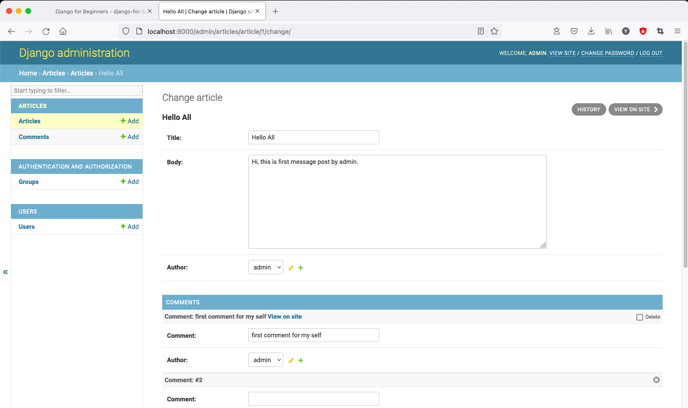

# Ch 15 Comments

Here are two ways to add comments in our website. One is to create comments app and link it to articles. Second is to add comment in article.model. This chapter will add comment on each article base on users.

## 1. Model, Add Data

add comment in models.py

```python
# articles/models.py
...
class Comment(models.Model):
    article = models.ForeignKey(
        Article,
        on_delete=models.CASCADE,
    )
    comment = models.CharField(max_length= 140)
    author  = models.ForeignKey(
        get_user_model(),
        on_delete = models.CASCADE,
    )

    def __str__(self):
        return self.comment

    def get_absolute_url(self):
        return reverse('artical_list')
```

and `makemigration articles` and `migrates`

## 2. Show in Admin page

Add in articles/admin.py

```python
# articles/admin.py
from django.contrib import admin

from .models import Article, Comment # new

admin.site.register(Article)
admin.site.register(Comment) # new
```

We can add comment by localhost:8000/admin

### Inlines

However the way to see the database by each table. Django provide **inlines** which display foreign key relationship in a better way.

There are 2 inline view `TabularInline` and `StackedInline`.

- first we modify the admin by `StackedInline`

    ```python
    # articles/admin.py
    from django.contrib import admin
    
    from .models import Article, Comment
    
    class CommentInline(admin.StackedInline): # new
        model = Comment
    
    class ArticleAdmin(admin.ModelAdmin):  # new
        inlines = [
            CommentInline,
        ]
    
    admin.site.register(Article, ArticleAdmin) # new
    admin.site.register(Comment)
    ```

    And show will like

    

- Second we switch to `TabularInline`

    ```python
    # articles/admin.py
    from django.contrib import admin
    
    from .models import Article, Comment
    
    class CommentInline(admin.TabularInline): # change
        model = Comment
    
    ...
    ```

    

## 3. Templates

Last, we change article list page, so we can show comments in page.

The Django build-in syntax is to use FOO_set for model name( FOO is the lowercase model name), here is example

```html
<!-- templates/artical_list.html -->
...

    
    <div class="card">
        <div class="card-header">
            <span class="font-weight-bold">{{ article.title }}</span> &middot;
            <span class="text-muted">by {{ article.author }} | {{ article.date }}</span>
        </div>
        <div class="card-body">
            <p>{{ article.body}}</p>
            <a href="">Edit</a> | 
            <a href="">Delete</a>
        </div>
        <div class="card-footer">
            <!-- Comment start -->
            
            <p>
                <span class="font-weight-bold">{{ comment.author }} &middot;</span>
                {{ comment }}
            </p>
            
            <!-- Comment end -->
        </div>
    </div>
    <br />
    

```

The other way is to use relate_named in model, that we can use this name to show the model with ForeignKey

First, modify the model

```python
# articles/models.py
...
class Comment(models.Model):
    article = models.ForeignKey(
        Article,
        on_delete=models.CASCADE,
          related_name='comments')  # new
    comment = models.CharField(max_length= 140)
    author  = models.ForeignKey(
        get_user_model(),
        on_delete = models.CASCADE,
    )

    def __str__(self):
        return self.comment

    def get_absolute_url(self):
        return reverse('artical_list')
```

Then use `article.comments.all` to show all comments

```html
<!-- templates/artical_list.html -->
...
<div class="card-footer">
    <!-- Comment start -->
    
    <p>
      <span class="font-weight-bold">{{ comment.author }} &middot;</span>
            {{ comment }}
    </p>
    
    <!-- Comment end -->
</div>
...
```

### Make sure to migrate data before run server

## Conclusion

- Demonstrate how foreign key relationship work in Django
- Still need polish. Like add comment pages, restriction for users, and so on.
